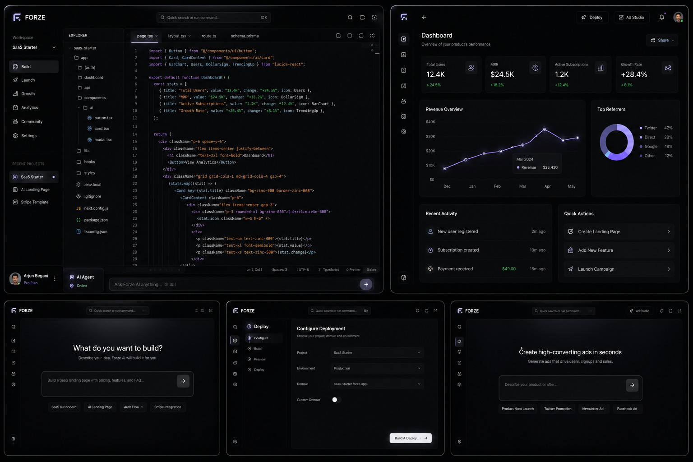

# Forze IDE

> **The Sovereign OS for Startup Founders** — the operating system for builders.

Forze is a premium, AI-native desktop workspace for vibe coders, indie hackers, and startup founders. It fuses a fast code editor, autonomous AI agents, one-click deployment, and a full "Startup OS" (analytics, ad studio, marketplace, community, team) into a single matte-black workbench — so you can build a product, launch it, and grow it without ever leaving the app.



---

## ✨ Highlights

- **AI-native editor** — lightweight [highlight.js](https://highlightjs.org/) syntax highlighting across ~190 languages, multi-tab editing, and an inline "Ask Forze" flow available from every surface.
- **Keyless out of the box** — ships with a built-in **Gemini** general model so chat works the moment you open the app. Want Claude or your own quota? Bring your own key (BYOK) per provider in Settings.
- **Startup OS** — full-page workspaces for Dashboard, Analytics, Deployments, Ad Studio, Marketplace, Community, and Team, opened as editor tabs.
- **Command bar** — a `cmdk`-powered palette for natural-language commands, navigation, and AI actions.
- **Integrated terminal** — built on [xterm.js](https://xtermjs.org/).
- **Builder OS aesthetic** — matte black surfaces with a single indigo accent, minimal borders, and ambient glow.
- **Resilient by design** — error boundaries isolate panel failures and a toast system surfaces feedback.

## 🧱 Tech Stack

| Layer | Technology |
| --- | --- |
| Shell | [Tauri v2](https://tauri.app/) (Rust) |
| UI | React 18 + TypeScript + Vite |
| State | Zustand |
| Editor | highlight.js |
| AI providers | Gemini (keyless default) + Anthropic Claude (BYOK) via `@forze/agents` |
| Data | Drizzle + SQLite (offline-first sync) |
| Tooling | pnpm workspaces |

## 📁 Workspace Layout

```
forze-suite/
├── apps/
│   ├── desktop/    Tauri v2 IDE shell (Rust + React + Vite)
│   └── web/        Next.js host (Forge)
└── packages/
    ├── agents/     AI provider abstraction (Gemini, Claude)
    ├── mcp-server/ Local Model Context Protocol daemon
    ├── database/   Drizzle / SQLite schemas + sync engine
    └── shared/     Cross-package Zod schemas
```

## 🚀 Quick Start

```bash
cd forze-suite
pnpm install

pnpm dev          # all workspaces in parallel
pnpm desktop      # Tauri IDE only
pnpm mcp          # MCP daemon only
pnpm web          # Next.js host only
```

> **Requirements:** Node ≥ 20 and pnpm ≥ 9.

### AI configuration

Forze works with zero setup using the built-in Gemini model. To customize:

- Copy `forze-suite/apps/desktop/.env.example` and set `VITE_FORZE_GEMINI_KEY` to bake in your own built-in key at build time, **or**
- Add your own Gemini / Anthropic key from **Settings → AI** at runtime (BYOK).

Key resolution order per provider: your own key first, then the built-in key (Gemini only).

## 🗺️ Roadmap

1. **Phase 1 — Core MVP:** AI editor, live preview, deployments, AI chat, templates, Ad Studio Lite.
2. **Phase 2 — Growth Layer:** community, marketplace, team collaboration, analytics.
3. **Phase 3 — Ecosystem:** AI agents, monetization, investor tools, full marketplace.

See [`features.md`](features.md) for the complete feature list and [`ide_plan.md`](ide_plan.md) for the technical specification.

---

> Long-term goal: become **the place where internet startups are built** — not just another AI IDE.
